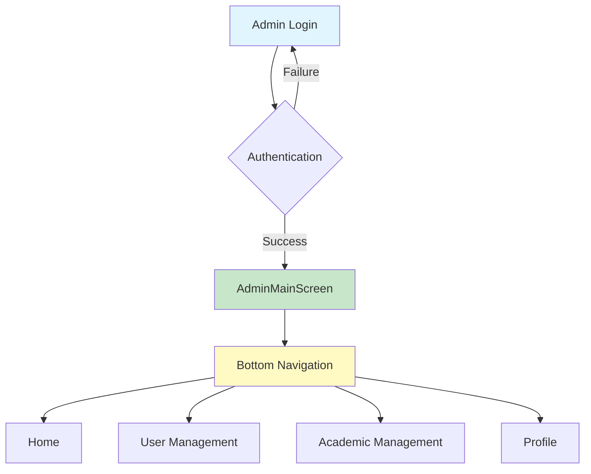
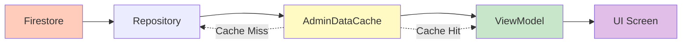
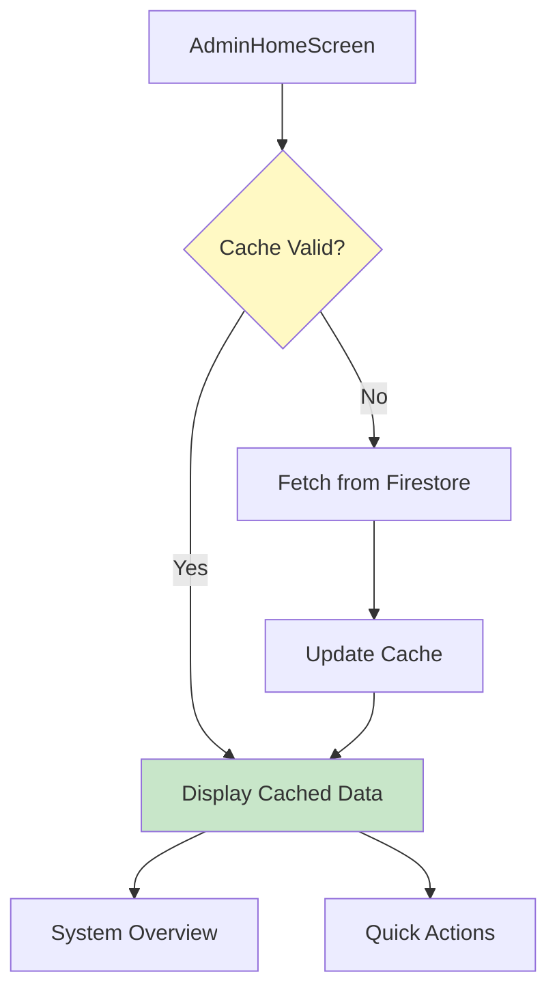
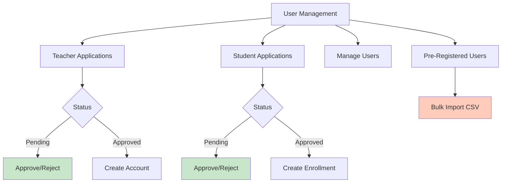
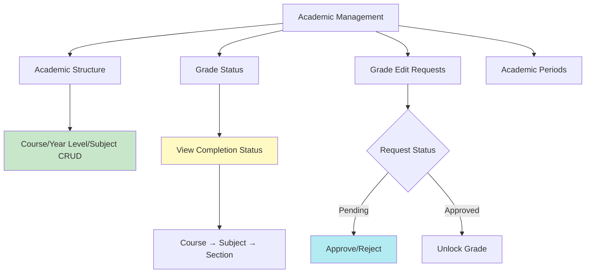

# Admin Side System Flowchart

## Overview
Simplified flowchart of the admin-side system architecture and key processes.

---

## 1. System Entry & Navigation



---

## 2. Data Flow



**Cache:** 5 minutes | **Types:** Subjects, Enrollments, Users, Applications, Courses, Year Levels

---

## 3. Home Tab



**Overview:** Total Subjects, Students, Teachers, Enrollments, Pending Applications

---

## 4. User Management



---

## 5. Academic Management



---

## 6. Key Processes

### Bulk Import
```
CSV File → Parse → Validate → Batch Write → Update Cache → Display Results
```

### Grade Edit Request
```
Teacher Request → Real-time Listener → Admin Review → Approve/Reject → Unlock Grade
```

### Application Approval
```
Application → Admin Review → Approve/Reject → Create Account/Enrollment → Notify
```

---

## 7. Technology Stack

- **UI:** Jetpack Compose
- **Architecture:** MVVM
- **DI:** Hilt
- **Database:** Firebase Firestore
- **Cache:** In-memory (5 min)
- **Real-time:** Firestore Listeners

---

*Last Updated: November 2025*
