# System Objectives Flowchart

## Overview
This document maps the system objectives to their implementation across Admin, Teacher, and Student sides.

---

## Objective 1: Teacher Grade Input with Admin Validation

**Goal:** Teachers input Prelim, Midterm, and Final grades → Admin monitors and validates for accuracy and authenticity.


**Key Features:**
- **Teacher Side:** Grade input with lock/unlock mechanism
- **Admin Side:** Real-time grade edit request monitoring
- **Admin Side:** Grade status tracking (Course → Subject → Section)
- **Validation:** Admin can review and validate grade accuracy
- **Real-time:** Live updates when grades are saved

---

## Objective 2: Real-time Student Performance Tracking

**Goal:** Students view and track their academic performance in real-time.


**Key Features:**
- **Real-time Updates:** Firestore listeners update student UI immediately
- **Performance Tracking:** Overview cards show current status
- **Grade Viewing:** All period grades (Prelim, Midterm, Final) visible
- **Analytics:** Visual insights updated in real-time
- **Cache Strategy:** Fast loading with background refresh

---

## Objective 3: Automated Final Grade Computation

**Goal:** System automatically computes final grade based on teacher-inputted grades.

```mermaid
flowchart TD
    A[Teacher: Input Prelim] --> D[GradeCalculationEngine]
    B[Teacher: Input Midterm] --> D
    C[Teacher: Input Final] --> D
    
    D --> E[Calculate Weighted Average]
    E --> E1[Prelim × 0.30]
    E --> E2[Midterm × 0.30]
    E --> E3[Final × 0.40]
    
    E1 --> F[Sum: Total Average]
    E2 --> F
    E3 --> F
    
    F --> G{Decimal = .5?}
    G -->|Yes| H[Round Up]
    G -->|No| I[Keep As Is]
    
    H --> J[Final Average]
    I --> J
    
    J --> K[Save to StudentGradeAggregate]
    K --> L[Update Firestore]
    L --> M[Real-time Update]
    M --> N[Student Sees Final Grade]
    
    O[Grade Status Determination] --> P{Check Final Average}
    P -->|≥ 90| Q[Status: PASSING]
    P -->|≥ 80| Q
    P -->|≥ 70| R[Status: AT_RISK]
    P -->|< 70| S[Status: FAILING]
    
    J --> O
    Q --> T[Update Student UI]
    R --> T
    S --> T
    
    style D fill:#fff9c4
    style F fill:#c8e6c9
    style H fill:#b2ebf2
    style J fill:#e1bee7
    style T fill:#ffccbc
```



**Calculation Formula:**
```
Final Average = (Prelim × 0.30) + (Midterm × 0.30) + (Final × 0.40)
```

**Rounding Rule:**
- If decimal = 0.5 → Round up (e.g., 74.5 → 75, 79.5 → 80)

**Automation Points:**
- **Automatic Calculation:** Triggered when any period grade is saved
- **Status Update:** Grade status (PASSING/AT_RISK/FAILING) calculated automatically
- **Real-time Sync:** Final grade appears immediately in student view
- **Aggregate Creation:** System creates/updates StudentGradeAggregate automatically

---

## Objective 4: Visual Insights for Academic Performance

**Goal:** Present graphs and status indicators to help students understand their academic performance trends.


**Visual Components:**

### Charts & Graphs:
1. **Performance Distribution Chart**
   - Bar chart showing Passing/At-Risk/Failing counts
   - Percentage breakdown per category

2. **Grade Trend Chart**
   - Line chart showing Prelim → Midterm → Final progression
   - Per-subject grade trends

3. **Subject Comparison Chart**
   - Comparison of average grades across subjects
   - Visual ranking of subject performance

### Status Indicators:
1. **Overview Cards**
   - Enrolled Subjects count
   - Total Subjects Passed count
   - Color-coded status badges

2. **Performance Snapshot**
   - Overall average grade
   - Passing/At-Risk/Failing subject counts
   - Quick status overview

3. **Grade Status Colors**
   - 🟢 Green: Passing (≥ 80)
   - 🟠 Orange: At-Risk (70-79)
   - 🔴 Red: Failing (< 70)

**Real-time Updates:**
- All charts and indicators update automatically when grades change
- Visual insights reflect current academic status
- Trend charts show performance progression over time

---

## Complete System Flow


---

## Technology Implementation

### Real-time Updates
- **Firestore Listeners:** Snapshot listeners for live data synchronization
- **StateFlow:** Reactive state management for UI updates
- **Cache Strategy:** 5-minute cache with background refresh

### Grade Calculation
- **GradeCalculationEngine:** Centralized calculation logic
- **Automatic Triggers:** Calculation on grade save
- **Status Determination:** Automatic grade status assignment

### Visual Components
- **MPAndroidChart:** Chart library for graphs
- **Jetpack Compose:** Modern UI framework
- **Material Design:** Consistent visual indicators

---

*Last Updated: November 2025*

