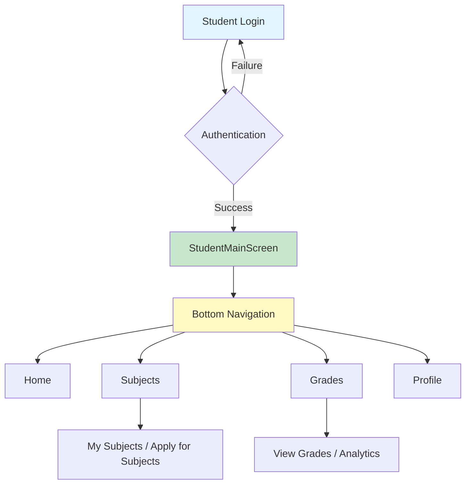
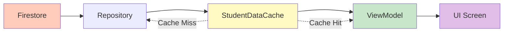
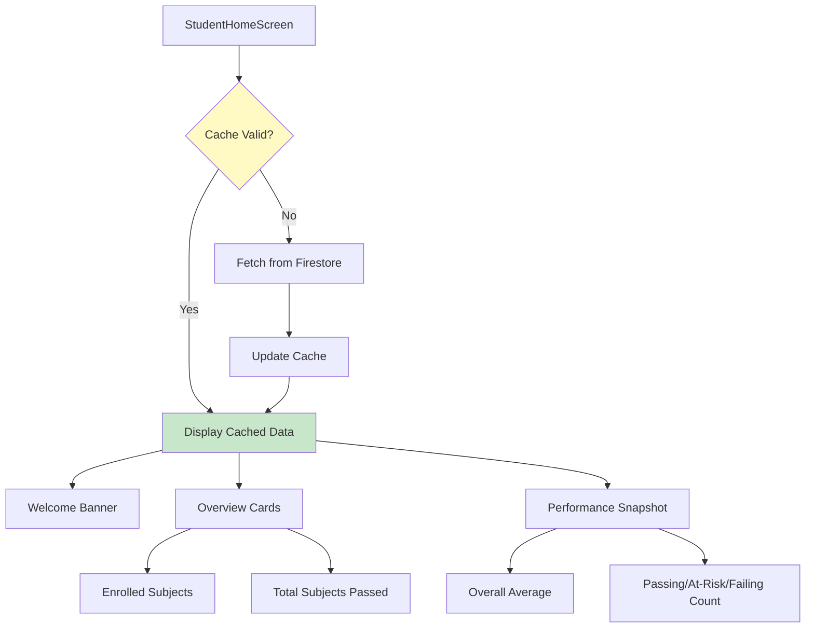
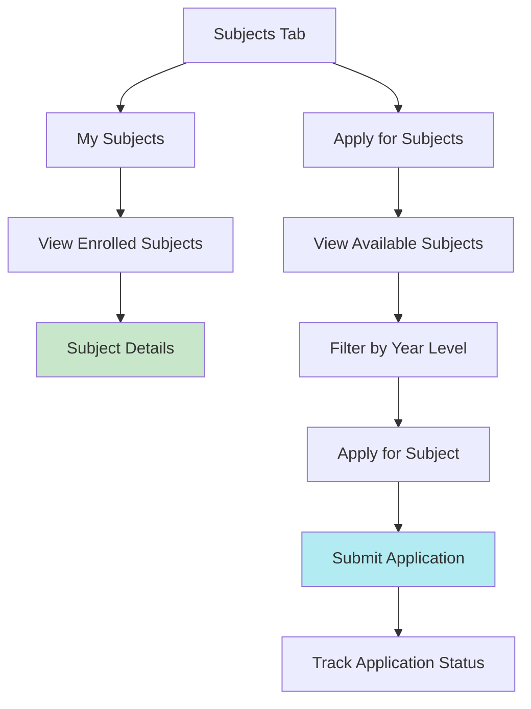
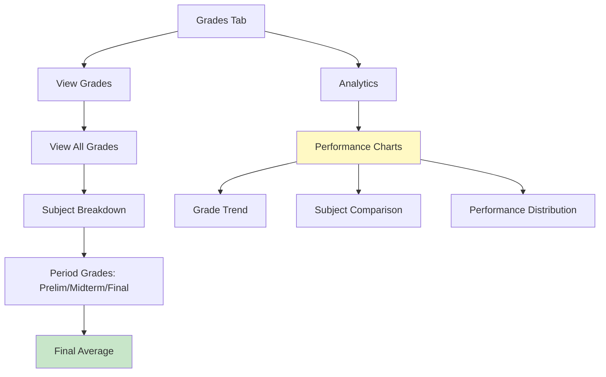
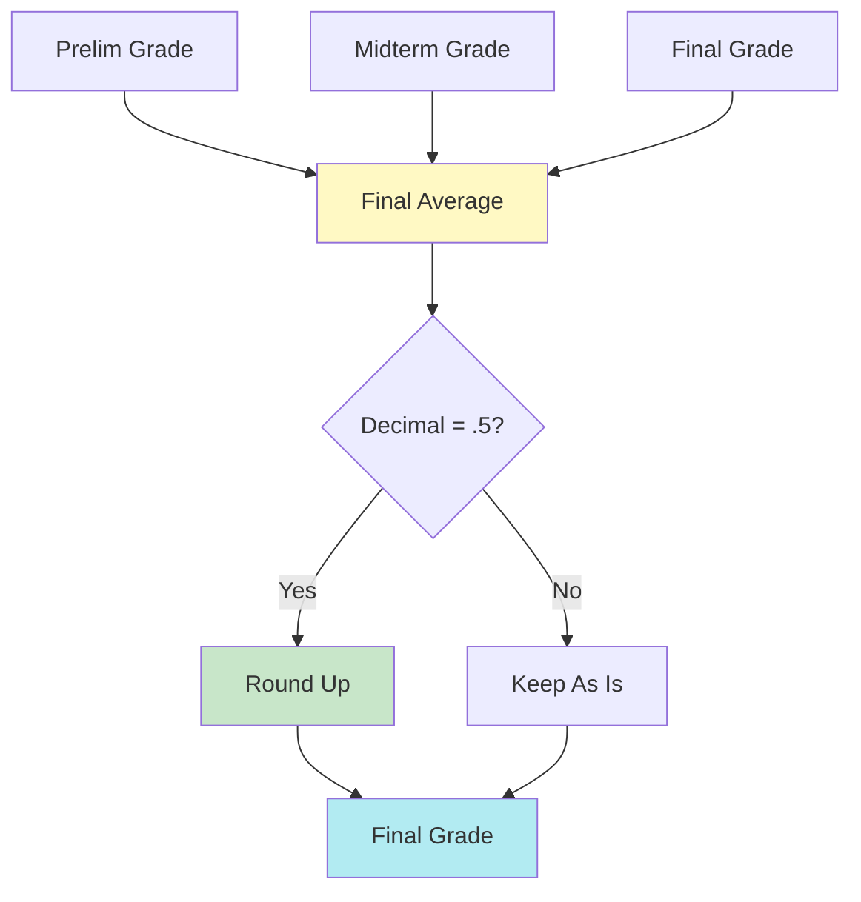

# Student Side System Flowchart

## Overview
Simplified flowchart of the student-side system architecture and key processes.

---

## 1. System Entry & Navigation



---

## 2. Data Flow



**Cache:** 5 minutes | **Types:** Enrollments, Grades, Grade Aggregates, Subjects, Applications

---

## 3. Home Tab



---

## 4. Subjects Tab



**Subject Filtering:** Only shows subjects matching student's year level/course

---

## 5. Grades Tab



**Grade Calculation:** Prelim (30%) + Midterm (30%) + Final (40%) | .5 values round up

---

## 6. Key Processes

### Subject Application
```
View Available → Filter by Year Level → Apply → Submit → Teacher Review → Approval/Rejection
```

### Grade Viewing
```
Load Enrollments → Load Grades → Calculate Aggregates → Display by Subject → Show Period Grades
```

### Analytics
```
Load Grade Aggregates → Calculate Statistics → Generate Charts → Display Performance
```

**Analytics Metrics:**
- Overall average grade
- Total subjects passed
- Passing/At-risk/Failing subjects count
- Grade trends per subject
- Subject performance comparison

---

## 7. Grade Calculation



**Formula:** (Prelim × 0.30) + (Midterm × 0.30) + (Final × 0.40)  
**Rounding:** 74.5 → 75, 79.5 → 80, etc.

---

## 8. Technology Stack

- **UI:** Jetpack Compose
- **Architecture:** MVVM
- **DI:** Hilt
- **Database:** Firebase Firestore
- **Cache:** In-memory (5 min)
- **Real-time:** Firestore Listeners

---

*Last Updated: November 2025*

