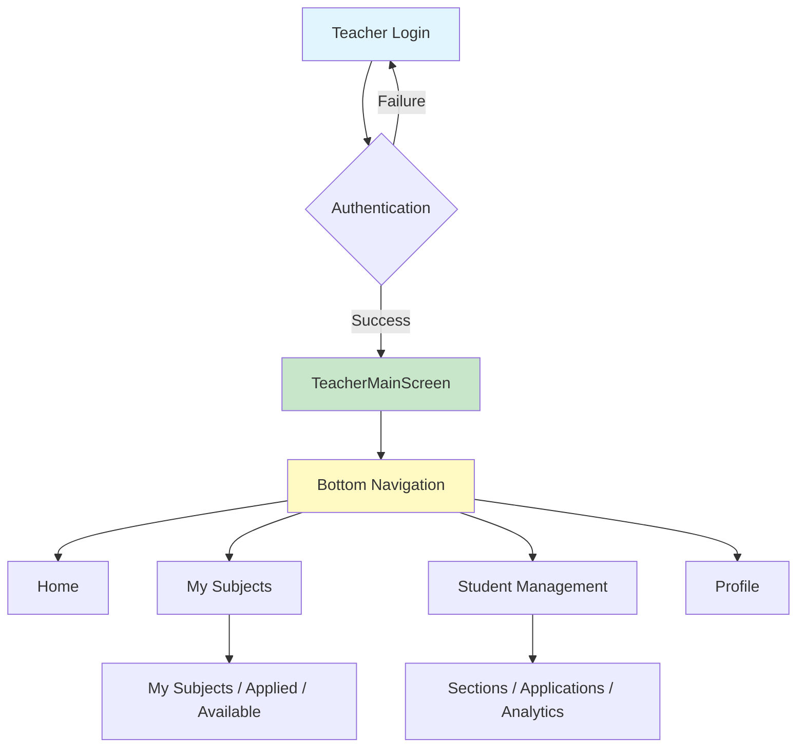
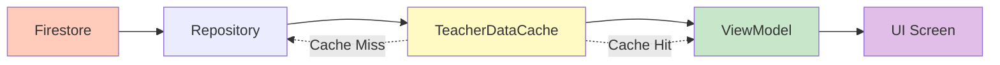
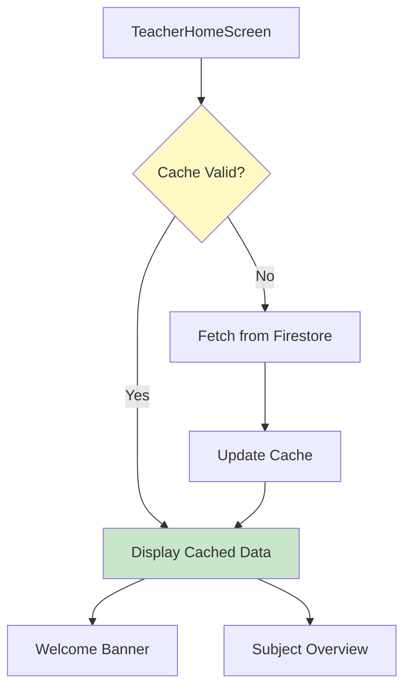
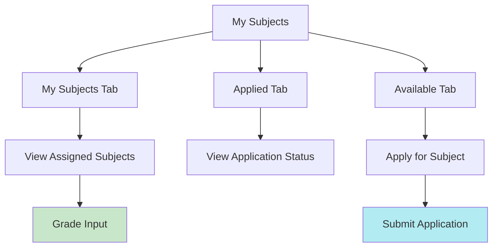
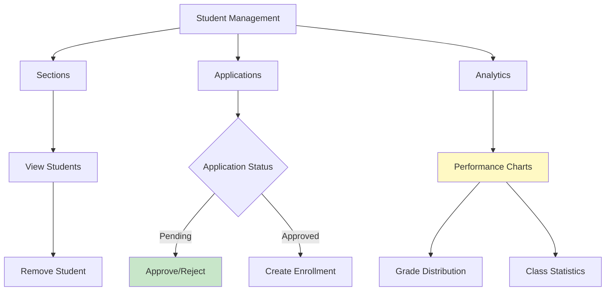
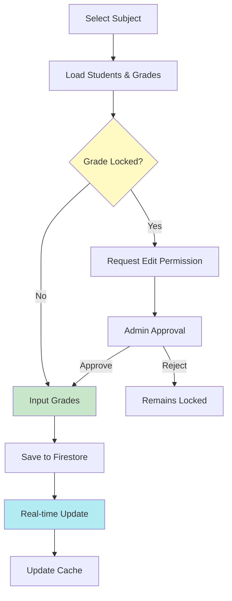

# Teacher Side System Flowchart

## Overview
Simplified flowchart of the teacher-side system architecture and key processes.

---

## 1. System Entry & Navigation



---

## 2. Data Flow



**Cache:** 5 minutes | **Types:** Subjects, Enrollments, Applications, Grades, Section Assignments

---

## 3. Home Tab



---

## 4. My Subjects Tab



---

## 5. Student Management Tab



---

## 6. Grade Input Process



**Grade Periods:** Prelim (30%) | Midterm (30%) | Final (40%) | Final Average (calculated)

---

## 7. Key Processes

### Subject Application
```
View Available → Check Sections → Apply → Submit → Admin Review → Approval/Rejection
```

### Student Application Approval
```
Application Received → Review → Approve/Reject → Create Enrollment → Notify
```

### Analytics
```
Load Subjects → Load Grades → Calculate Aggregates → Generate Charts → Display
```

**Analytics Metrics:**
- Average grade per subject
- Passing rate
- Grade distribution (75+, <75)
- Class comparison charts

---

## 8. Technology Stack

- **UI:** Jetpack Compose
- **Architecture:** MVVM
- **DI:** Hilt
- **Database:** Firebase Firestore
- **Cache:** In-memory (5 min)
- **Real-time:** Firestore Listeners

---

*Last Updated: November 2025*
