# Smart Academic Performance Tracker - Use Case Diagram

## UML Use Case Diagram

```mermaid
graph TB
    subgraph System["Smart Academic Performance Tracker System"]
        %% Core Use Cases
        UC1[REGISTER ACCOUNT]
        UC2[LOGIN]
        UC3[MANAGE PROFILE]
        UC4[VIEW GRADES]
        UC5[APPLY FOR SUBJECTS]
        UC6[VIEW APPLICATION STATUS]
        UC7[VIEW PERFORMANCE ANALYTICS]
        UC8[INPUT GRADES]
        UC9[MANAGE STUDENTS]
        UC10[MANAGE STUDENT APPLICATIONS]
        UC11[VIEW CLASS ANALYTICS]
        UC12[PRE-REGISTER USERS]
        UC13[MANAGE ACADEMIC STRUCTURE]
        UC14[ASSIGN TEACHERS TO SECTIONS]
        UC15[MANAGE SYSTEM DATA]
        UC16[VIEW NOTIFICATIONS]
    end
    
    %% Actors
    Student((Student))
    Teacher((Teacher))
    Admin((Admin))
    Guest((Guest))
    
    %% Student Relationships
    Student --> UC1
    Student --> UC2
    Student --> UC3
    Student --> UC4
    Student --> UC5
    Student --> UC6
    Student --> UC7
    Student --> UC16
    
    %% Teacher Relationships
    Teacher --> UC2
    Teacher --> UC3
    Teacher --> UC5
    Teacher --> UC6
    Teacher --> UC8
    Teacher --> UC9
    Teacher --> UC10
    Teacher --> UC11
    Teacher --> UC16
    
    %% Admin Relationships
    Admin --> UC2
    Admin --> UC3
    Admin --> UC12
    Admin --> UC13
    Admin --> UC14
    Admin --> UC15
    Admin --> UC16
    
    %% Guest Relationships
    Guest -.-> UC2
    
    %% Use Case Relationships (Extends - dashed arrow)
    UC2 -.->|<<extends>>| UC1
    
    %% Use Case Relationships (Includes - dashed arrow)
    UC8 -.->|<<include>>| UC9
    UC5 -.->|<<include>>| UC6
    UC4 -.->|<<include>>| UC7
    UC10 -.->|<<include>>| UC9
    UC15 -.->|<<include>>| UC13
    
    style System fill:#e1f5ff,stroke:#01579b,stroke-width:3px
    style Student fill:#fff9c4,stroke:#f57f17,stroke-width:2px
    style Teacher fill:#c8e6c9,stroke:#2e7d32,stroke-width:2px
    style Admin fill:#f3e5f5,stroke:#7b1fa2,stroke-width:2px
    style Guest fill:#e0e0e0,stroke:#616161,stroke-width:2px
```

## Detailed Use Case Descriptions

### Authentication Use Cases

#### UC1: REGISTER ACCOUNT
- **Actor**: Student
- **Description**: Students activate their pre-registered accounts by entering their Student ID and creating a password
- **Preconditions**: Student must be pre-registered by Admin
- **Postconditions**: Account is activated and student can login

#### UC2: LOGIN
- **Actor**: Student, Teacher, Admin, Guest
- **Description**: Users authenticate using their institutional ID and password
- **Extends**: REGISTER ACCOUNT (users must have an account to login)
- **Preconditions**: User must have an activated account
- **Postconditions**: User is authenticated and redirected to role-specific dashboard

#### UC3: MANAGE PROFILE
- **Actor**: Student, Teacher, Admin
- **Description**: Users can view and update their personal information
- **Preconditions**: User must be logged in
- **Postconditions**: Profile information is updated

### Student Use Cases

#### UC4: VIEW GRADES
- **Actor**: Student
- **Description**: View grades by subject with detailed breakdowns (Prelim, Midterm, Final)
- **Includes**: VIEW PERFORMANCE ANALYTICS
- **Preconditions**: Student must be logged in

#### UC5: APPLY FOR SUBJECTS
- **Actor**: Student, Teacher
- **Description**: Submit application to enroll in available subjects or apply to teach subjects
- **Includes**: VIEW APPLICATION STATUS
- **Preconditions**: User must be logged in

#### UC6: VIEW APPLICATION STATUS
- **Actor**: Student, Teacher
- **Description**: Track the status of submitted subject applications
- **Preconditions**: User must have submitted at least one application

#### UC7: VIEW PERFORMANCE ANALYTICS
- **Actor**: Student
- **Description**: View grade history, comparison, and study progress with visual charts
- **Preconditions**: Student must be logged in and have grades

### Teacher Use Cases

#### UC8: INPUT GRADES
- **Actor**: Teacher
- **Description**: Input and manage grades (Prelim, Midterm, Final) for students
- **Includes**: MANAGE STUDENTS (to select students for grading)
- **Preconditions**: Teacher must be assigned to a subject section

#### UC9: MANAGE STUDENTS
- **Actor**: Teacher
- **Description**: View sections, enrolled students, and remove students with reason tracking
- **Preconditions**: Teacher must be assigned to a subject section

#### UC10: MANAGE STUDENT APPLICATIONS
- **Actor**: Teacher
- **Description**: Review and approve/reject student applications for their subjects
- **Includes**: MANAGE STUDENTS
- **Preconditions**: Teacher must be assigned to a subject

#### UC11: VIEW CLASS ANALYTICS
- **Actor**: Teacher
- **Description**: View class performance analytics with filters and visualizations
- **Preconditions**: Teacher must be logged in and have students with grades

### Admin Use Cases

#### UC12: PRE-REGISTER USERS
- **Actor**: Admin
- **Description**: Pre-register students and teachers with their institutional IDs and information
- **Preconditions**: Admin must be logged in

#### UC13: MANAGE ACADEMIC STRUCTURE
- **Actor**: Admin
- **Description**: Create, update, and manage courses, year levels, and subjects
- **Preconditions**: Admin must be logged in

#### UC14: ASSIGN TEACHERS TO SECTIONS
- **Actor**: Admin
- **Description**: Assign teachers to specific subject sections
- **Preconditions**: Admin must be logged in, teachers and subjects must exist

#### UC15: MANAGE SYSTEM DATA
- **Actor**: Admin
- **Description**: Manage academic periods, review applications, monitor grades, manage users, and system configuration
- **Includes**: MANAGE ACADEMIC STRUCTURE
- **Preconditions**: Admin must be logged in

#### UC16: VIEW NOTIFICATIONS
- **Actor**: Student, Teacher, Admin
- **Description**: View real-time notifications with unread count badges
- **Preconditions**: User must be logged in

## Use Case Relationships

### Extends Relationship (<<extends>>)
- **LOGIN extends REGISTER ACCOUNT**: Users must have an account (registered/activated) before they can login

### Includes Relationship (<<include>>)
- **INPUT GRADES includes MANAGE STUDENTS**: To input grades, teachers must select students from their managed sections
- **APPLY FOR SUBJECTS includes VIEW APPLICATION STATUS**: When applying, users can view their application status
- **VIEW GRADES includes VIEW PERFORMANCE ANALYTICS**: Viewing grades includes viewing analytics
- **MANAGE STUDENT APPLICATIONS includes MANAGE STUDENTS**: Managing applications involves managing students
- **MANAGE SYSTEM DATA includes MANAGE ACADEMIC STRUCTURE**: System data management includes academic structure management

## Actor Descriptions

### Student
- Primary user of the system
- Can view their own grades, apply for subjects, and track academic performance
- Has access to personal analytics and notifications

### Teacher
- Can input and manage grades for students in their assigned sections
- Can manage student applications and view class analytics
- Can apply to teach additional subjects

### Admin
- Has full system access
- Manages academic structure, user accounts, and system configuration
- Can pre-register users and assign teachers to sections

### Guest
- Limited access (can only attempt login)
- May view public information if implemented

## System Boundary

The system boundary includes all use cases within the "Smart Academic Performance Tracker System" box, representing the complete functionality of the mobile application.

---

**Note**: This simplified diagram focuses on the core functionality. Additional features like grade export, submission tracking, and detailed analytics are part of the main use cases but not shown separately to maintain clarity.

